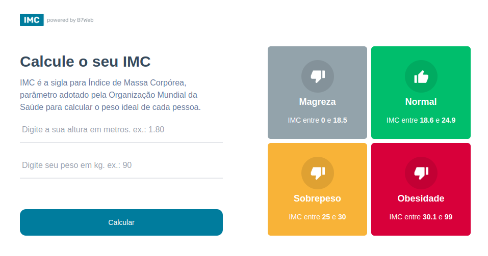

# Calculadora de IMC com React

Este é um projeto criado com [Next.js](https://nextjs.org) e [React](https://reactjs.org), que permite calcular o Índice de Massa Corporal (IMC) de forma prática e rápida. O projeto foi iniciado com [`create-next-app`](https://nextjs.org/docs/app/api-reference/cli/create-next-app).

---

## 📸 Screenshot

---

## 🚀 Como começar

Siga os passos abaixo para rodar o projeto localmente:

### Instalação

1. Clone este repositório:
   
   git clone https://github.com/davihenriquedev1/calculadora-imc-react.git
   cd calculadora-imc-react

2. Instale as dependências:

    npm install

3. Inicie o servidor de desenvolvimento:

    npm run dev
    ### ou
    yarn dev
    ### ou
    pnpm dev
    ### ou
    bun dev

4. Abra http://localhost:3000 no seu navegador para visualizar o resultado.

## Tecnologias utilizadas 🛠

React: Biblioteca para construção de interfaces de usuário.
Next.js: Framework para aplicações React com renderização no lado do servidor.
Tailwind CSS: Framework utilitário para estilização.
TypeScript: Suporte para tipagem estática no JavaScript.

## Saiba mais 📚

Para aprender mais sobre Next.js e outras tecnologias utilizadas no projeto, confira os recursos abaixo:

## Deploy 🚀 

A forma mais fácil de fazer o deploy deste projeto é utilizando a Plataforma Vercel, desenvolvida pelos criadores do Next.js.

Confira a documentação de deploy para mais detalhes.

## Contribuição 😊

Fique à vontade para abrir issues ou enviar pull requests no repositório! Sugestões e melhorias são sempre bem-vindas. 